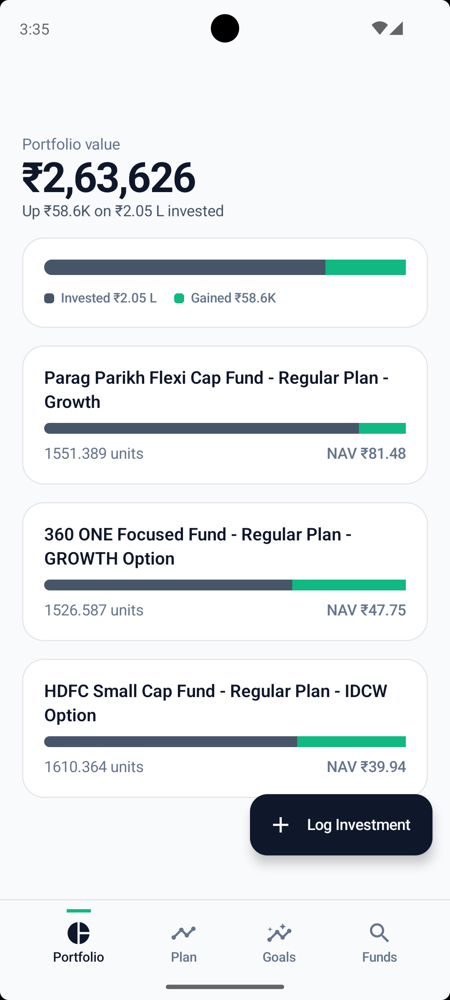
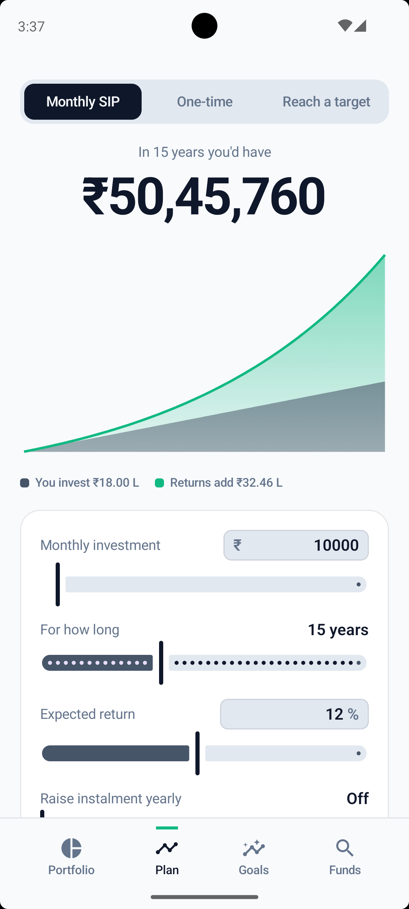
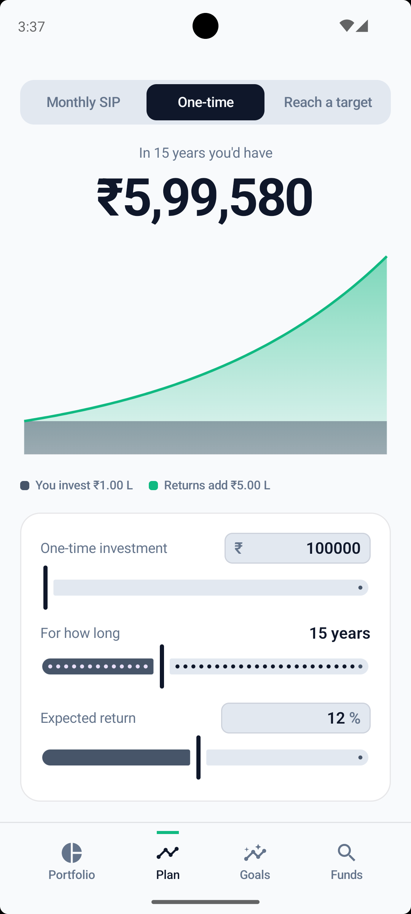
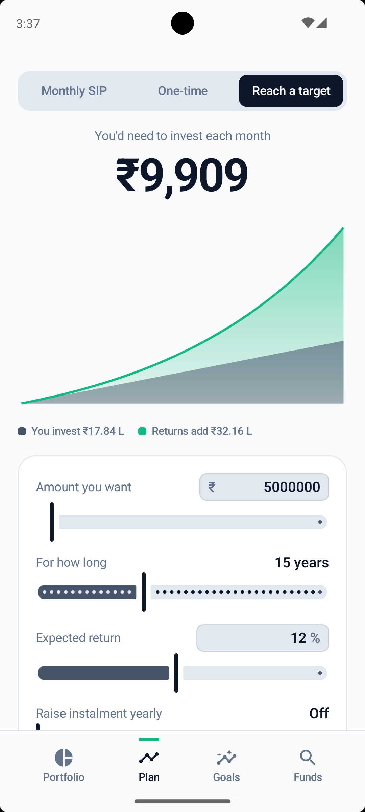
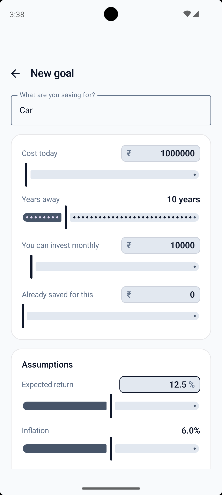
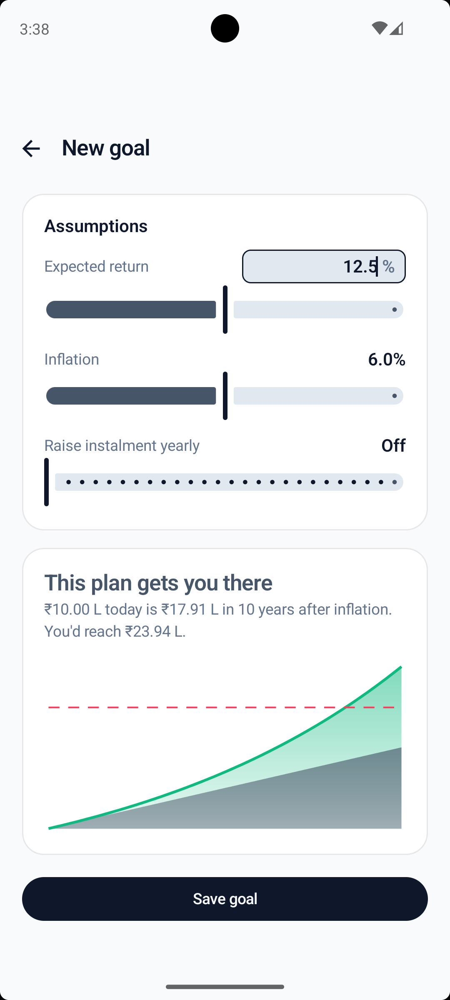
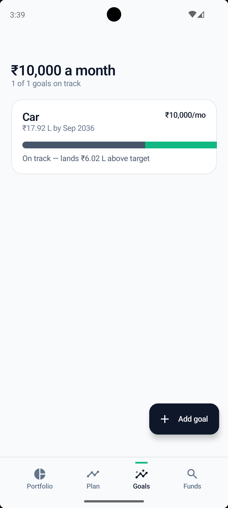
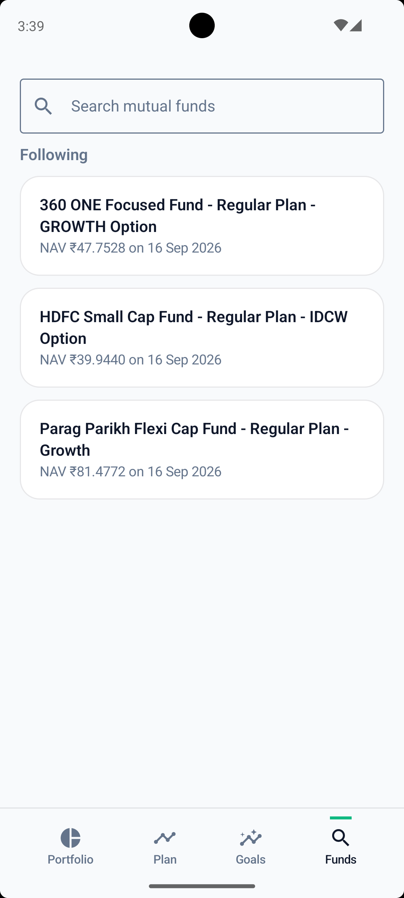

# SIP Planner 📈

[](https://developer.android.com/studio)
[](https://kotlinlang.org)
[](https://developer.android.com)
[](https://developer.android.com)
[](LICENSE)

An **offline-first, privacy-focused Android application** for planning mutual fund SIPs, goal-based wealth tracking, and portfolio XIRR management.

Built entirely on **free, keyless infrastructure** — no paid APIs, no backend cloud servers, no user tracking, and no subscriptions.

---

## 📱 App Screenshots

<p align="center">
  
  
  
  
</p>

<p align="center">
  
  
  
  
</p>

---

## 💡 How It Helps

Standard SIP calculators only answer *"how much will I have?"* assuming a fixed monthly amount. **SIP Planner** helps you make realistic financial decisions by answering:
1. **Goal Reality Check:** *"Will my current monthly investment actually reach my target after inflation?"*
2. **Reverse Target Solver:** *"How much do I need to invest monthly starting today to buy a house or retire in 15 years?"*
3. **True Portfolio Performance:** *"What is my actual XIRR return across irregular SIP payments made at different dates?"*

### Key Features

- 🧮 **Interactive Calculator:** SIP, One-time Lumpsum, and Reverse-Target calculations with yearly step-up support. Drag sliders or type exact numbers directly with the numeric keyboard.
- 🎯 **Goal-Based Tracking:** Create inflation-adjusted goals (House Down Payment, Emergency Fund, Education) with real-time on-track / shortfall status.
- 📊 **Real-Time Portfolio & XIRR:** Log your actual paid SIP instalments. The app prices your holdings with live daily NAVs from AMFI and calculates your weighted **XIRR (Extended Internal Rate of Return)**.
- 🔍 **Mutual Fund Watchlist:** Search 10,000+ public Indian mutual fund schemes via AMFI (`api.mfapi.in`), view historical NAV graphs, trailing returns (1Y, 3Y, 5Y), and follow your favorite schemes.
- ⏰ **Offline Reminders:** Local monthly notifications via Android WorkManager to remind you to log your SIP payments — zero push services or external servers required.

---

## 🛠️ Tech Stack & Libraries

- **Language:** 100% [Kotlin](https://kotlinlang.org/) (Coroutines, Flow, StateFlow)
- **UI Framework:** [Jetpack Compose](https://developer.android.com/jetpack/compose) with Material 3 Design System
- **Architecture:** Clean Architecture + Unidirectional Data Flow (UDF)
- **Dependency Injection:** [Hilt](https://developer.android.com/training/dependency-injection/hilt-android)
- **Local Database:** [Room Database](https://developer.android.com/training/data-storage/room) with KSP
- **Networking:** [Retrofit 2](https://square.github.io/retrofit/) + [OkHttp 5](https://square.github.io/okhttp/) + Kotlinx Serialization
- **Background Jobs:** [WorkManager](https://developer.android.com/topic/libraries/architecture/workmanager)
- **Graphics:** Custom Compose `Canvas` drawing for zero-dependency high-performance charts
- **Testing:** JUnit4, Kotlinx Coroutines Test, Turbine, MockK

---

## 🏗️ Architecture & Project Structure

The project follows **Clean Architecture** principles separated into a single module with three distinct layers. Dependencies point inward toward the core domain.

```
ui (Compose + ViewModels)  ──►  domain (Models + Repository Interfaces)  ◄──  data (Room + Retrofit)
                                               ▲
                                     core/finance (Pure Kotlin)
```

### Module Breakdown

| Directory | Role & Description |
| :--- | :--- |
| **`core/finance`** | Pure Kotlin financial math engine (SIP calculations, Binary Search Goal Solver, Newton-Raphson XIRR). Zero Android dependencies, 100% unit-tested. |
| **`core/format`** | Indian currency formatting engine (Lakh / Crore Indian Numbering System formatting). |
| **`domain`** | Pure business models and repository abstractions. Independent of Room or Retrofit. |
| **`data`** | Room DAOs and entities, Retrofit REST client, mappers, and repository implementations. |
| **`ui`** | Jetpack Compose screens, ViewModels, Emerald & Slate theme, custom Canvas charts. |
| **`di`** | Dependency injection Hilt modules. |
| **`work`** | WorkManager background workers for local monthly SIP reminders. |

---

## 🎨 Design System: Emerald & Slate

Every calculation and chart in the app separates money into two distinct parts:
1. **Money You Invested (Principal):** Styled in Slate (`#475569`).
2. **Compounding Gains (Returns):** Styled in Emerald Green (`#10B981`).

| Token | Hex | Usage |
| :--- | :--- | :--- |
| **Paper** | `#F8FAFC` | Clean slate background |
| **Ink** | `#0F172A` | Primary text and dark elements |
| **Principal** | `#475569` | Muted slate — capital invested by user |
| **Returns** | `#10B981` | Emerald green — compounding profit generated |
| **Shortfall** | `#F43F5E` | Rose red — shortfall / loss |
| **Mist** | `#64748B` | Secondary text |

---

## 🚀 Setup & Installation Guide

### Prerequisites
- **Android Studio:** Ladybug (2024.2.1) or newer
- **JDK:** Version 17
- **Android SDK:** `compileSdk 37`, `minSdk 26`

### Building the App

1. **Clone the repository:**
   ```bash
   git clone https://github.com/abhishukla0204/SIP-Planner.git
   cd SIP-Planner
   ```

2. **Open in Android Studio:**
   - Select **File → Open** and choose the `SIP-Planner` directory.
   - Allow Gradle to sync dependencies.

3. **Run on Emulator or Physical Device:**
   - Select the **`app`** run configuration from the top toolbar.
   - Press **Run ▶** or press `Shift + F10`.

---

## 📐 Under the Hood: Financial Math

### 1. Bisection Goal Solver
Standard closed-form formulas break down when incorporating yearly step-ups or existing saved capital. **`GoalSolver`** uses a binary search (bisection method) over the monotonic future-value function. This converges in fewer than 20 iterations to solve the exact monthly base instalment required for any goal.

### 2. Newton-Raphson XIRR
CAGR assumes a single initial investment. Because SIPs consist of multiple cash flows on different dates, **SIP Planner** calculates true yield using a **Newton-Raphson XIRR solver**, falling back to bisection if the derivative approaches zero.

---

## 🧪 Running Tests

To run the unit test suite covering the financial engine, goal solver, XIRR calculations, and mappers:

```bash
./gradlew testDebugUnitTest
```

---

## 📄 License

This project is licensed under the **MIT License**. See the [LICENSE](LICENSE) file for details.
